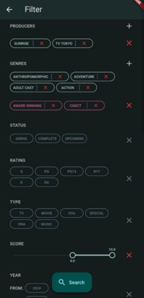

# Smile

App for browsing animes.

The project contains multiple packages, but the entry point is *packages/app*.

The animes is fetched from the [JikanApi](https://jikan.moe/)

  

See *doc/videos/demo.mp4* for interactive example.

# Install dependencies
Run the script *tools/setup-flutter.sh*.

[Melos](https://melos.invertase.dev/) is used to manage and release the packages.
Install melos:
```
dart pub global activate melos
```

# Run
The main package is located at *packages/app*.

To run the app:
```
cd packages/app
flutter run
```

